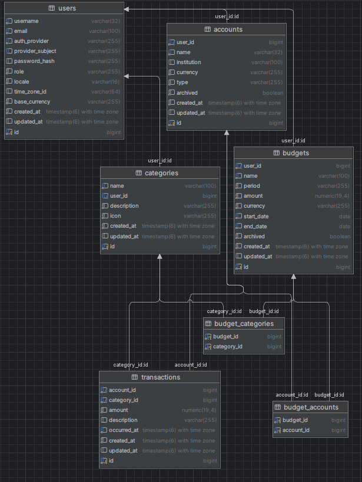

## Demo Deployment

A live demo deployment is available for preview and evaluation purposes.  
> Note: Not all endpoints are implemented in the frontend.

- **Frontend:** https://optifi.kvtmail.com  
- **Backend API:** https://api.optifi.kvtmail.com/api

---

# OptiFI

OptiFI is a personal finance tracking application built with a modern Java + React stack.

It allows users to manage:
- accounts
- transactions
- categories
- budgets

The project is split into a backend (Spring Boot) and a frontend (React + Vite).

---

## Tech Stack

### Backend
- Java
- Spring Boot
- Spring Security (JWT)
- JPA / Hibernate
- PostgreSQL

### Frontend
- React
- Vite

---

## Diagram of the backend architecture



---

## Running locally

### Prerequisites
- **JDK 17+**
- **Node.js 18+**
- **H2 (demo & test) / PostgreSQL (dev & prod)**

> In development, the database schema is **auto-created** by the backend.  
> No manual SQL setup is required.  
> Demo/test use an **in-memory H2** database (data resets on restart).

Optional: add google id to `application-dev.properties` to enable Google OAuth:
```properties
security.google.client-id=OPTIONAL_YOUR_GOOGLE_ID
```

---

### Ports
- Backend: http://localhost:8080  
- Frontend: http://localhost:5173  

Running the backend and frontend requires **two terminals**.

---

### Backend

> Demo configuration (H2) is set in `application-demo.properties`.

From repo root:

```powershell
# Windows (PowerShell)
cd backend; $env:SPRING_PROFILES_ACTIVE="demo"; .\gradlew.bat bootRun
```

```bash
# Linux / macOS
cd backend && SPRING_PROFILES_ACTIVE=demo ./gradlew bootRun
```

Alternative (works in any shell):

```bash
cd backend && ./gradlew bootRun -Dspring-boot.run.profiles=demo
```

The backend runs until stopped with Ctrl+C.

---

### Frontend

From repo root:

```bash
npm --prefix frontend install
npm --prefix frontend run dev
```

---

## Status

This project is under active development.
